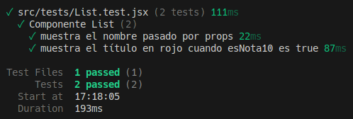
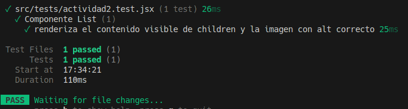
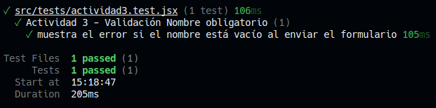
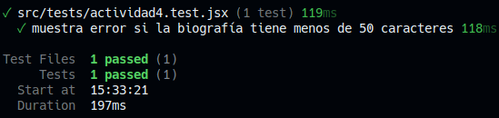
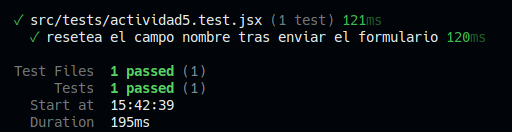
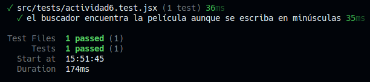
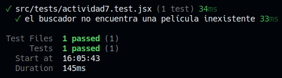
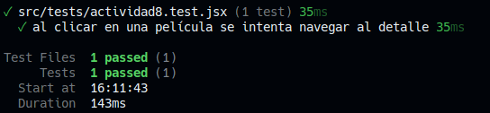
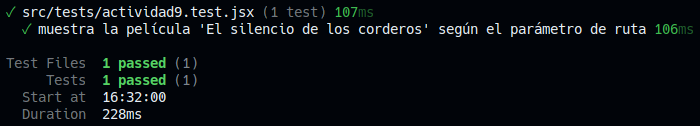
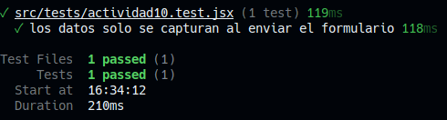

# Informe de Testing - Juan Sebastian Franco
## Actividad 1
* **Reto:** Breve descripción de lo que se testea.  
Se testea si el nombre que se pasa por los props se muestra de forma correcta, a la vez que comprueba cuando un actor tiene una nota de 10 si el titulo se muestra en rojo (600). 

* **Prompt IA:** ¿Qué le has preguntado a la IA para obtener el código?  
Comprueba que el componente List muestra correctamente el nombre pasado por props y que, si la película tiene una nota de 10, el título aparece en color rojo (clase text-red-600).

* **Explicación del Test:** Breve explicación de cómo se testea, la
anatomía del Test (AAA); dónde puedes explicar, por ejemplo, qué hace el
selector getByRole o within, etc.  
Primero se renderiza el componente, luego se comprueba si es correcto el render.
getByRole - Busca que el rol exista (heading).
getByText - Busca texto en la pantalla.
toHaveClass - Busca que tenga el estilo pasado (text-red-600)

> 

# Informe de Testing - Juan Sebastian Franco
## Actividad 2
* **Reto:** Breve descripción de lo que se testea.  
Se testea si el renderizado del componente List es correcto, paso seguido comprobamos sis el contenido renderiza de forma correcta el children y la imagen con su correspondiente texto alternativo.

* **Prompt IA:** ¿Qué le has preguntado a la IA para obtener el código?  
Verifica que el componente List renderiza correctamente el contenido que se le pasa a través de children (recuerda que se usa para la clasificación o biografía) y comprueba que la imagen tiene el atributo alt correcto basado en el nombre del intérprete o de la película.  
(Daba error por lo que pregunte lo siguiente):
Se genera un error ya que dice que hay elementos con el mismo resultado, como los separo del p?

* **Explicación del Test:** Breve explicación de cómo se testea, la
anatomía del Test (AAA); dónde puedes explicar, por ejemplo, qué hace el
selector getByRole o within, etc.  
Se renderiza List, luego se verifica si su renderizacion es correcta.
getByText - Busca texto en la pantalla.
getByAltText - Busca la imagen con el atributo alt.
toBeInTheDocument - Confirma si existen los componentes 
toHaveAttribute -Confirma si las propiedades son correctas.
selector - filtra el elemento solicitado.

> 

# Informe de Testing - Juan Sebastian Franco
## Actividad 3
* **Reto:** Breve descripción de lo que se testea.  
Se testea que el campo del nombre obligue al usuario a llenarlo, en caso de que no lo haga e intente enviarlo, no le deje y le muestre error.

* **Prompt IA:** ¿Qué le has preguntado a la IA para obtener el código?  
Como puedo comprobar con este formulario, que el campo del nombre sea obligatorio al ser enviado.

* **Explicación del Test:** Breve explicación de cómo se testea, la
anatomía del Test (AAA); dónde puedes explicar, por ejemplo, qué hace el
selector getByRole o within, etc.  
Se renderiza el formulario, se envia el formulario y se comprueba si existe error.
getByRole - Busca que el rol exista (button).
fireEvent - (Se usa porque userEvent no funciona) Simula un evento de interaccion del usuario.
.click() - Simula la accion de click de un usuario.

> 

# Informe de Testing - Juan Sebastian Franco
## Actividad 4
* **Reto:** Breve descripción de lo que se testea.  
EL test busca saber si con una descripcion por debajo de 50 caracteres al momento de ser enviado el formulario se genera error de forma correcta.

* **Prompt IA:** ¿Qué le has preguntado a la IA para obtener el código?  
Como testeo si SOLO la descripcion me genera error por estar debajo de los 50 caracteres?

* **Explicación del Test:** Breve explicación de cómo se testea, la
anatomía del Test (AAA); dónde puedes explicar, por ejemplo, qué hace el
selector getByRole o within, etc.  
Se renderiza el formulario, se envia el formulario y se comprueba si existe error.
fireEvent - (Se usa porque userEvent no funciona) Simula un evento de interaccion del usuario.
.click() - Simula la accion de click de un usuario.

> 

# Informe de Testing - Juan Sebastian Franco
## Actividad 5
* **Reto:** Breve descripción de lo que se testea.  
Se testea si luego de enviar el formulario del componente, los campos vuelven a estar vacios.

* **Prompt IA:** ¿Qué le has preguntado a la IA para obtener el código?
Como puedo saber si el formulario luego de enviarse vuelve a estar vacio?

* **Explicación del Test:** Breve explicación de cómo se testea, la
anatomía del Test (AAA); dónde puedes explicar, por ejemplo, qué hace el
selector getByRole o within, etc.
Se renderiza el formulario, se escribe en los campos, se envia y se comprueba que hace reset.  
Se rellenan todos los campos porque en caso contrario daria error ya que hay que llenarlos.   
getByRole - Busca que el rol exista (button).
fireEvent - (Se usa porque userEvent no funciona) Simula un evento de interaccion del usuario.
.click() - Simula la accion de click de un usuario.
.change() - Simula que el usuario cambia un valor.
.submit() - Simula el envio del formulario

> 

# Informe de Testing - Juan Sebastian Franco
## Actividad 6
* **Reto:** Breve descripción de lo que se testea.  
Se testea si en el componente, el buscador es capaz de encontrar el mismo resultado sin importar que se busque mediante minusculas.

* **Prompt IA:** ¿Qué le has preguntado a la IA para obtener el código?  
Como testeo que en el componente aunque busque en minusculas siga apareciendo un resultado?

* **Explicación del Test:** Breve explicación de cómo se testea, la
anatomía del Test (AAA); dónde puedes explicar, por ejemplo, qué hace el
selector getByRole o within, etc.  
Renderizamos el componente con el uso de MemoryRoute ya que sirve como testeo sin realmente modificar una ruta, se simula la busqueda de 'sexto' en minusculas, y se comprueba si el resultado es el esperado.  
.getByPlaceholderText() - Busca el input por su tipo (placeholder)
.change() - Simula la escritura del usuario
.getByText() - Comprueba si el texto existe.
.toBeInDocument() - Comprueba si es el resultado esperado.

> 

# Informe de Testing - Juan Sebastian Franco
## Actividad 7
* **Reto:** Breve descripción de lo que se testea.  
Se testea si el componente renderiza un mensaje de error cuando se busca una pelicula que no existe.

* **Prompt IA:** ¿Qué le has preguntado a la IA para obtener el código?  
Como testeo si una peli inexistente se busca, salga el error "No se encontraron películas con el término..."?

* **Explicación del Test:** Breve explicación de cómo se testea, la
anatomía del Test (AAA); dónde puedes explicar, por ejemplo, qué hace el
selector getByRole o within, etc.  
Renderizamos el componente con el uso de MemoryRoute ya que sirve como testeo sin realmente modificar una ruta, se simula la busqueda de 'Iron Man', y se comprueba si el resultado es el esperado.  
.getByPlaceholderText() - Busca el input por su tipo (placeholder)
.change() - Simula la escritura del usuario
.getByText() - Comprueba si el texto existe.
.toBeInDocument() - Comprueba si es el resultado esperado.

> 

# Informe de Testing - Juan Sebastian Franco
## Actividad 8
* **Reto:** Breve descripción de lo que se testea.  
Se testea si se muestra los detalles de una pelicula o si la ruta cambia de forma correcta.

* **Prompt IA:** ¿Qué le has preguntado a la IA para obtener el código?  
Como testeo si los detalles de la pelicula se intenta cargar/mostrar bien (URL)?

* **Explicación del Test:** Breve explicación de cómo se testea, la
anatomía del Test (AAA); dónde puedes explicar, por ejemplo, qué hace el
selector getByRole o within, etc.  
Renderizamos el componente con el uso de MemoryRoute ya que sirve como testeo sin realmente modificar una ruta, se simula la carga de los detalles de una pelicula en busca de saber si funciona correctamente.   
.initialEntries(/) - Inicializa la ruta principal
.getByText() - Busca que se encuentre el texto.
.closest("a") - Busca el primer nodo, que en este caso es "a", que se refiere al Link pero el DOM lo interpreta asi.
.click() - Simula la accion de hacer el click.
.toHaveAttribute("href" , "...") - Comprueba que el elemento tenga ese atributo y con un valor esperado.

> 

# Informe de Testing - Juan Sebastian Franco
## Actividad 9
* **Reto:** Breve descripción de lo que se testea.  
Se testea si en los detalles se muestra el nombre de la pelicula segun el parametro pasado.

* **Prompt IA:** ¿Qué le has preguntado a la IA para obtener el código?  
Como puedo saber si al entrar a /detalle/pelicula/4 se muestra el nombre de la pelicula "El silencio de los corderos"?

* **Explicación del Test:** Breve explicación de cómo se testea, la
anatomía del Test (AAA); dónde puedes explicar, por ejemplo, qué hace el
selector getByRole o within, etc.  
Primero se renderiza, se inicializa la ruta destino, y por ultimo se verifica si el nombre de la pelicula como titulo se muestra de forma correcta.
.initialEntries(/detalle/pelicula/4) - Inicializa la ruta principal en la cuarta pelicula.
.getByRole("heading", {level: 1, name: ...}) - Busca que el elemento h1 del heading contenga el nombre del valor.
.toBeInTheDocument() - Comprueba que el elemento exista.

> 

# Informe de Testing - Juan Sebastian Franco
## Actividad 10
* **Reto:** Breve descripción de lo que se testea.  
Se testea si el componente solo valida los datos al momento de enviar el formulario mas no al añadir los valores en los campos.

* **Prompt IA:** ¿Qué le has preguntado a la IA para obtener el código?  
Como compruebo si se valida despues de enviar y no antes?

* **Explicación del Test:** Breve explicación de cómo se testea, la
anatomía del Test (AAA); dónde puedes explicar, por ejemplo, qué hace el
selector getByRole o within, etc.  
Se inicializa el componente, se simula la introduccion de un valor a un input, se busca que no se valide, se envia y se comprueba si se valida.
.getByLabelText() - Busca un input por su label.
.getByRole() - Busca un rol (button).
.click() - Simula la accion del click.
.change() - Simula un valor puesto por el usuario.
.queryByText(/texto/i) - Comprueba que no exista un texto.
.getByDisplayValue - Comprueba que el input tenga un valor.

> 